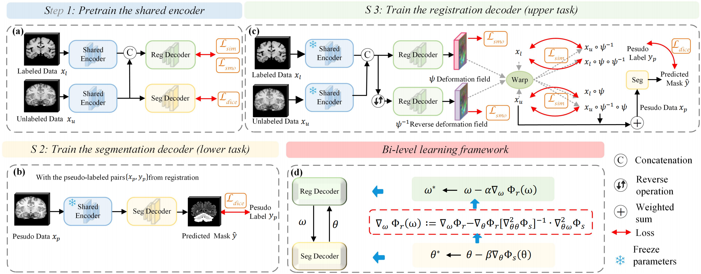
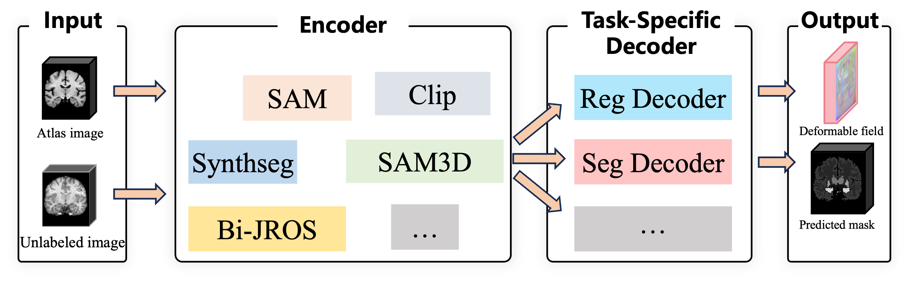

# Bi-JROS: Bi-level Learning of Task-Specific Decoders for Joint Registration and One-Shot Medical Image Segmentation

<a href="https://scholar.google.com/citations?user=vLN1njoAAAAJ&hl=zh-CN&oi=ao" target="_blank">Xin Fan</a><sup>1</sup>,
Xiaolin Wang<sup>1</sup>,</span>
<a href="https://scholar.google.com/citations?user=MWPKMlsAAAAJ&hl=zh-CN&oi=ao" target="_blank">Jiaxin Gao</a><sup>1</sup>,
<a href="https://scholar.google.com/citations?user=UNXTe-4AAAAJ&hl=zh-CN" target="_blank">Jia Wang</a><sup>1</sup>,
Zhongxuan Luo<sup>1</sup>,</span>
Risheng Liu<sup>1</sup> </span>

<sup>1</sup>School of Software Technology, Dalian University of Technology, Dalian, China &nbsp;&nbsp;

[🏡 Project Page](https://bi-jros.github.io/) |  [📄 Paper](https://openaccess.thecvf.com/content/CVPR2024/html/Fan_Bi-level_Learning_of_Task-Specific_Decoders_for_Joint_Registration_and_One-Shot_CVPR_2024_paper.html) 

## 🎺 News
-  [2025/04/28]: ✨Adapt Different Encoders (eg. sam, synthseg) to Our Framework (updating).
- [2025/04/27]: ✨We release the model weight of Bi-JROS in the Step 1:Pretrain the shared encder [🤗 Huggingface](https://huggingface.co/jiawang0704/Bi-JROS-Step1/tree/main)
- [2024/04/23]: ✨We release the train and inference code.
- [2024/02/27]: ✨This paper was accepted by CVPR 2024!



## REQUIREMENTS
This code requires the following:
* Python==3.8
* PyTorch==1.12.1
* Torchvision==0.13.1
* Torchaudio==0.12.1
* Numpy==1.24.3
* Scipy==1.10.1
* Scikit-image==0.21.0
* Nibabel==5.2.0 

## DATA
The datasets used in the paper, ABIDE, ANDI, PPMI, and OASIS, are publicly available for download.  
For example, ADNI can be applied for and downloaded through the following link: [https://adni.loni.usc.edu/data-samples/adni-data/#AccessData](https://adni.loni.usc.edu/data-samples/adni-data/#AccessData).  
The download process for ABIDE is described at [https://fcon_1000.projects.nitrc.org/indi/abide/databases.html](https://fcon_1000.projects.nitrc.org/indi/abide/databases.html).  
Preprocessed ABIDE data can be accessed at [http://preprocessed-connectomes-project.org/abide/index.html](http://preprocessed-connectomes-project.org/abide/index.html).  

## USAGE
### Step 1: Getting Started

Clone the repo:
```
git clone https://github.com/Coradlut/Bi-JROS.git
```

### Step 2: Training 

```
python train.py
```
Before executing the code, it may be necessary to configure certain parameters in accordance with specific requirements.

### Step 3: Prediction

To test the performance:

```
python infer.py
```


# Adapt Different Encoders to Our Framework (Updating)

In this section, we demonstrate how we adapt different encoders to our framework. Specifically, we focus on integrating four encoders: **SAM**, **SynthSeg**, and two of our own proposed methods. We will showcase the results of applying these encoders and provide a brief introduction to each of the methods.

## 1. Introduction to the Methods

### SAM (Self-Attention Mechanism)

SAM introduces prompt-based guidance to enable fast segmentation of arbitrary targets within an image. Prompts can take various forms, such as points, boxes, masks, or text descriptions. Based on these prompts, the model generates valid segmentation masks. The encoder of SAM consists of two parts: the image encoder and the prompt encoder. The image encoder generates a one-time embedding that captures the overall representation of the input image. The prompt encoder encodes points, boxes, text, or masks into embedding vectors in real time, which are then combined with the image embedding to guide the segmentation process.

#### Key Features:
- **One-Time Embedding**: Generates a single global image representation with a pre-trained Vision Transformer.
- **Prompt Encoding**: Dynamically embeds points, boxes, masks, and text to guide segmentation.

**Reference**: [SAM Paper (Kirillov et al., 2023)](https://arxiv.org/abs/2304.02643)

### SynthSeg

SynthSeg trains the network with on-the-fly synthesized images using a Bayesian generative model and domain randomization, enabling it to learn domain-agnostic features and perform direct segmentation on real images without retraining. SynthSeg uses a 3D U-Net encoder to extract domain-agnostic features from on-the-fly synthesized images. By processing inputs with randomized contrast, resolution, and artifacts, the encoder learns robust structural representations for accurate segmentation across diverse domains.

#### Key Features:
- **Domain Randomization**: Trained on images with randomized contrast, resolution, noise, and artifacts to ensure robustness.
- **3D U-Net Architecture**: Uses deep hierarchical features and skip connections to capture both local and global structure.
- **On-the-Fly Data Augmentation**: Continuously exposed to new synthetic inputs during training, enhancing generalization without retraining.

**Reference**: [SynthSeg Paper (Billot et al., 2021)](https://arxiv.org/abs/2107.09559)


### Our Proposed Method 1: Bi-JROS

Bi-JROS introduces a novel bi-level learning framework for one-shot medical image segmentation, using a pretrained fixed shared encoder to stabilize training and enhance adaptability. It treats registration as the major objective and segmentation as a learnable constraint, while leveraging appearance conformity to generate style-consistent pseudo-labels for data augmentation. The pretrained and fixed shared encoder extracts stable, domain-adaptive features from medical images, providing a common feature space for both the registration and segmentation decoders.

#### Key Features:
- **Pretrained on diverse unlabeled data**: Extracts stable and domain-adaptive features for one-shot medical segmentation.
- **Fixed parameters after pretraining**: Prevents feature drift and ensures stable optimization during downstream tasks.
- **Shared feature space for tasks**: Provides unified features for both registration and segmentation decoders.

**Reference**: [Bi-JROS Paper (Fan et al., 2024)](https://openaccess.thecvf.com/content/CVPR2024/papers/Fan_Bi-level_Learning_of_Task-Specific_Decoders_for_Joint_Registration_and_One-Shot_CVPR_2024_paper.pdf)

### Our Proposed Method 2: RRL-MedSAM

RRL-MedSAM adapts SAM for one-shot 3D medical image segmentation by introducing a dual-stage knowledge distillation (DSKD) strategy and a mutual-EMA mechanism to train lightweight general and medical-specific encoders. The General Encoder distilled from SAM for domain-agnostic feature learning and the Medical Encoder specialized for fine-grained 3D medical image segmentation, jointly optimized via mutual-EMA collaboration.

#### Key Features:
- **Dual encoders**: General and Medical encoders collaboratively learn domain-agnostic and medical-specific features.
- **Dual-stage knowledge distillation**: Two-step distillation with mutual-EMA ensures robust and harmonized feature representation.
- **Auto-prompting decoder**: Automatically generates prompts from coarse masks to enhance segmentation without manual interaction.

**Reference**:

---

## 2. Results Comparison

In this section, we present the results of applying the different encoders to our framework. The **Dice coefficient** is used as the evaluation metric to compare the segmentation performance of each method.

| Encoder Method       | Dice Coefficient (%) [OASIS] | Dice Coefficient [Dataset 2] | Dice Coefficient [Dataset 3] |
|----------------------|------------------------------|------------------------------|------------------------------|
| **SAM**              | 71.58                         | --                         | --                         |
| **SynthSeg**         | --                         | --                         | --                        |
| **Bi-JROS**        |  81.4                        | --                        | --                         |
| **RRL-SAM**        | 82.4                         | --                         | --                         |


<!-- ## 3. Conclusion

By adapting these different encoders into our framework, we are able to leverage the strengths of each method to improve our segmentation accuracy and generalization. SAM and SynthSeg provide strong attention mechanisms and generalization from synthetic data, while our proposed methods offer specialized approaches for fine-grained details and sequential data handling.

We encourage further exploration and experimentation with these encoders to optimize segmentation results across a variety of medical imaging tasks.

---

**Note:** The Dice coefficient values presented above demonstrate how well each encoder performs across different datasets. These results indicate the effectiveness of our framework in handling various medical imaging challenges. -->

## Quick Start
- Downloading the pretrained weghts for train in [huggingface](https://huggingface.co/jiawang0704/Multi-encoders).

Set hyperparameters ‘enc’(eg. sam, sythseg, bi-jros. and rrl-sam) to select which necoder to adapt to our framework. 
```
python train_arbi_enc4dec.py -enc bi-jros
```
<!-- 
```
python infer_arbi_enc4dec.py 
``` -->